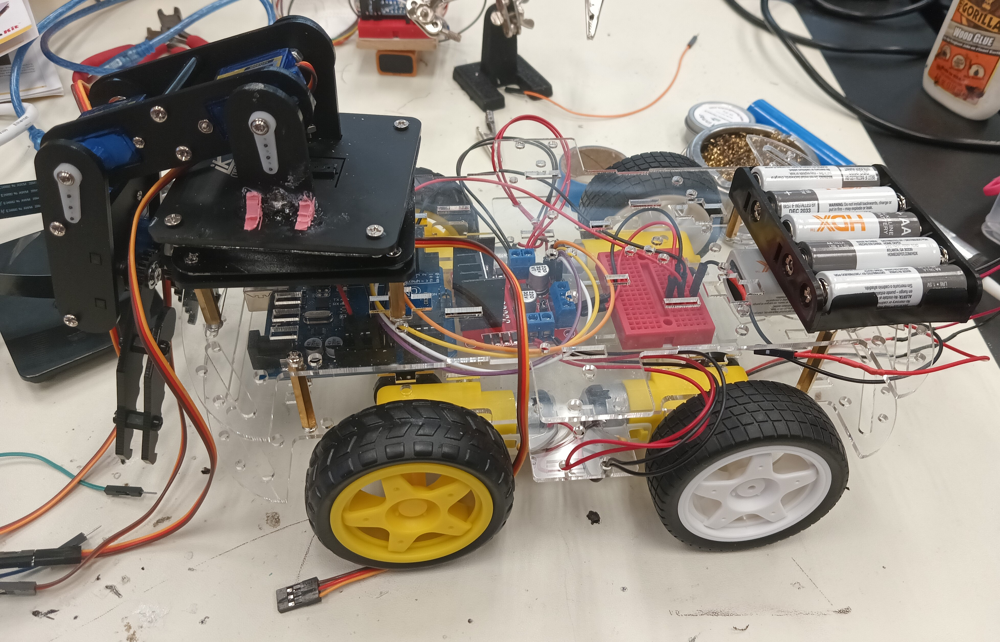
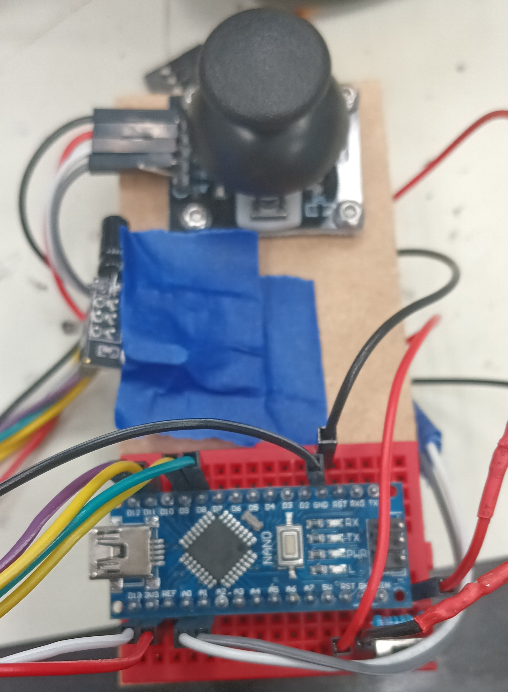

# A.I. Powered Claw Car
<!--Replace this text with a brief description (2-3 sentences) of your project. This description should draw the reader in and make them interested in what you've built. You can include what the biggest challenges, takeaways, and triumphs from completing the project were. As you complete your portfolio, remember your audience is less familiar than you are with all that your project entails!-->

| **Engineer** | **School** | **Area of Interest** | **Grade** |
|:--:|:--:|:--:|:--:|
| Zia S. | Archbishop Mitty Highschool | Computer Engineering | Incoming Sophmore |

<figure>
  
  <figcaption>Picture of Me (2024)</figcaption>
</figure>
  
# 3rd Milestone (A.I. Powered Claw Car)

<iframe width="560" height="315" src="https://www.youtube.com/embed/YPYSJYxstzI" title="Zia S. Third Milestone" frameborder="0" allow="accelerometer; autoplay; clipboard-write; encrypted-media; gyroscope; picture-in-picture; web-share" referrerpolicy="strict-origin-when-cross-origin" allowfullscreen></iframe>


<figure>
  
</figure>
<figure>
  
</figure>

<!--For your final milestone, explain the outcome of your project. Key details to include are:
- What you've accomplished since your previous milestone
- What your biggest challenges and triumphs were at BSE
- A summary of key topics you learned about
- What you hope to learn in the future after everything you've learned at BSE-->

<h1>Summary</h1>
<h2>Project</h2>
My project is an A.I. Powered Claw Car, a robot controlled by a wireless remote that travels using 4 wheels and has a servo-powered claw attached on top. Using a raspberry camera module and the object identification A.I. program, Tensorflow, it is capable of identifying various objects based a training data set and pick them up with the claw. <br>

<h2>Components</h2>
<ul>
  <li>4 Wheel Acrylic Car Chassis</li>
  <li>RC Wheels</li>
  <li>TT Motors</li>
  <li>L298N Motor Driver Module</li>
  <li>Arduino Uno</li>
  <li>Arduino Nano</li>
  <li>Arduino Joystick Module</li>
  <li>Jumper Cables</li>
  <li>Small Breadboards</li>
  <li>9V Batteries</li>
  <li>NRF24L01 Wireless Modules<1i>
  <li>Cokoino Claw Arm</li>
  <li>Wooden Board</li>
  <li>Small Switch</li>
  <li>1 uF Capacitors</li>
</ul>

<h2>How Components Work Together</h2>
&nbsp;&nbsp;&nbsp;&nbsp;&nbsp;The Arduino Nano, the joystick module, the small breadboard, and the wireless module are all mounted on a small, rectangular board with the battery velcroed behind. The battery powers the Arduino Nano that contains the code to read the analog values of joystick based on its position, convert the values into bytes (integers 0-255), and transmit those values through the wireless module to be received by the wireless module of the Arduino Nano on the car chassis. With the switch, the remote can be turned on and off. The Arduino Uno on the car chassis processes the received values and based on them, commands the motor driver to power the wheels in a certain direction. For example, holding the joystick forward will move the car forwards, holding it backward moves the car backwards, and vice versa for turining left and right. The entire car chassis is also powered by a 9V battery. 

<h2>Progress</h2> <!-- What I did in previous milestones and what I did for third milestone. -->
&nbsp;&nbsp;&nbsp;&nbsp;&nbsp;For the third milestone, I cut out a small rectangular board with a saw and drilled holes into it to act as the base for my remote. I then screwed the joystick module on the board and using the breadboard adhesive, mounted the small breadboard with the Arduino Nano on the board as well. I then made the necessary connection for the remote to work using the jumper cables and also attached the battery to the back of the board using velcro. Finally, I finished the remote by taping the wireless module to the middle of the board. I also setup the necessary connections on the Arduino Uno of the car to make sure that the wireless module was working properly. I coded the remote and the car and was successfully able to control the car wirelessly with little latency. However, I later realized that the car chassis I had from milestone 1 was not large enough to fit all of the necessary hardware for the robot so I asked my instructors for a bigger car chassis to replace it. I assembled the new chassis with four new motors mand mounted the Arduino Uno, a new motor driver, a small breadboard for ground and power connections, and a 9V battery to it. I then reprogrammed the Arduino Uno to controll four wheels instead of two. Finally, I mounted the claw on top of the car using screws and tested the car to see how well it could move with the heavy claw. It worked very well and was able to move effortlessly. 

<h2>Challenges Faced</h2>
&nbsp;&nbsp;&nbsp;&nbsp;&nbsp;I had many challenges with the third milestone with one of the them being the setup of the wireless module. It required very specific code and wire connections for it to work properly as it has 7 pins that neeeded to be connected to specfic places on the Arduinos for it to work properly. When it did not work the first time, I had to solder a capacitor to each module for less power fluctations so that a smooth connection could be created bewteen the two wireless modules. It started working afterwards, but I then ran into another issue with the transmission of data. At first, I coded the remote to transmit the x value first and then the y value of the joystick module to the car, causing a bug in which the value that was received second would permanently drop the zero and not update. To fix this, I changed the code to send the joystick values in a structure or a data package so the values were sent at the same time. Overall, it took me almost two days to setup the wireless modules. Another challenge I faced was that one motor would always be slower than the other when moving forward, leading to the car turning. This was a problem most likely caused by the universal wheel or the motor driver glitching out but was fixed when I switched to the new car chassis with four wheels, making it virtually impossible for it to not move forward when intended. The switch unfortunetly led to a new problem that wasted three days. The previous motor driver was capable of controlling the speed of the motors with purely code, but the new motor driver needed a separate pin, the Enable pin, to be connected to the 
Arduino Uno in order to control the speed of the motors. I was absolutely not able to get this to work and tried multiple motor drivers to find out what was wrong. In the end, I gave on on speed control as it was already taking up too much time and moved on to coding the new controls for the car. I was able to control the car as before except it would go forward without turning which was fantastic but run into yet another issue: my computer suddenly stopped working and was not able to access the arduino .inos for the remote and the car, disallowing me from further debugging. I cannot access the codes which is why they are not on this portfolio. As such, I am forced to leave the car and remote as they are despite any bugs that may come up. 

<h2>Next Step</h2>
&nbsp;&nbsp;&nbsp;&nbsp;&nbsp; For my modifications or final milestone, I shall add the A.I aspect of the project and use Tensorflow, an object identification program, to power the claw using a Raspberry Pi. 

<h2>Hexapod_Ultrasonic2_OLED.ino</h2>

```c++


```

<!--**Don't forget to replace the text below with the embedding for your milestone video. Go to Youtube, click Share -> Embed, and copy and paste the code to replace what's below.**-->

# Second Milestone (A.I. Powered Claw Car)

<iframe width="560" height="315" src="https://www.youtube.com/embed/mGiasDcI_J0" title="Zia S. Second Milestone" frameborder="0" allow="accelerometer; autoplay; clipboard-write; encrypted-media; gyroscope; picture-in-picture; web-share" referrerpolicy="strict-origin-when-cross-origin" allowfullscreen></iframe>

<figure>
  
</figure>

<h1>Summary</h1>
<h2>Project</h2>
My project is an A.I. Powered Claw Car, a robot that travels using 2 wheels controlled by servos and has a claw attached on top. Using a raspberry camera module and an object identification A.I. program, it is capable of identifying various objects based a training data set and pick them up with the claw. <br>

<h2>Components</h2>
<ul>
  <li>Acrylic Plates</li>
  <li>Arduino Nano</li>
  <li>Arduino Shield</li>
  <li>Servo Package</li>
  <li>Joysticks</li>
  <li>USB Cable</li>
  <li>Jumper Cables</li>
  <li>Battery Case</li>
  <li>AA Batteries</li>
  <li>Turntable</li>
</ul>

<h2>How Components Work Together</h2>
&nbsp;&nbsp;&nbsp;&nbsp;&nbsp; The acrylic parts of the claw act as the base and main body that house the servos, Arduino Nano, and Arduino shield. The base of the claw has a servo that rotates a ball-bearing wheel, rotatating the entire claw. Two other servos control the arm of the claw, making it capable of moving up or down. The final servo controls the actual claw; it is attached to one claw half with a gear at the end that is in contact with the gear of the other claw half so when the servo rotates, the entire claw grabs or releases. The servos are controlled by two joysticks that are connected to the Arduino Nano; one controls the rotation and position of the claw arm and the other control the claw itself. 

<h2>Progress</h2>
&nbsp;&nbsp;&nbsp;&nbsp;&nbsp;For the second milestone, I had to cut the ground and voltage wires of the battery port of the claw and solder them to a new battery case as lithium batteries are not allowed in Bluestamp projects. Before beginning assembly, I used the Arduino program, Servo_90_ADJ.ino, provided by the pdf claw tutorial to adjust the servos to all be 90°, using a USB to connect the Arduino Nano to my computer. I then assembled the stand for the Arduino Nano and shield using standoffs and did the same for the ball-bearing base of the claw arm. Next, I added the servo for the base of the claw arm and attached a rectangular piece to it that would allow the servo to rotate the entire base. I then screwed together the claw arm with two servos, making sure that they were straight. Finally, I screwed in the servo for the claw and attached the claw half to it and lined up the other half with the first. I then assembled a simple controller using one of the acrylic plates and screwing in two joysticks. I then did the necessary wiring for the claw to properly work and be controllled by the claw. I uploaded the Arduino program, Arm.ino, provided by the tutorial to the Arduino Nano, allowing me to control the claw with the joysticks. 

<h2>Challenges Faced</h2>
&nbsp;&nbsp;&nbsp;&nbsp;&nbsp;One of the major problems I faced with the claw assembly was screwing in small screws into tiny nuts in tight spaces. It was quite difficult for me and wasted a lot of time. Eventually, I figured out a way to make it easier by always turning the claw over to a side in which the nut would be lying down to facilitate the screwing process. Another problem I faced was accidently attached the rectangular piece the wrong way on the base servo. This was an issue because one, the traction of the servo and the ball-bearing base was weak, leading to little rotation, and two, removing the servo arm from the rectangular piece is difficult. The servo arm is attached to the retangular piece using self-tapping screws which are difficult to remove once they are screwed in. It also did not help that the screwdriver I was using broke away from the handle, making it ineffective. I wasted more time trying to remove the self-tapping screws but managed to get them out using a plier that had a good grip on them. <br>

<h2>Next Step</h2>
&nbsp;&nbsp;&nbsp;&nbsp;&nbsp;My third milestone will be mounting the claw onto the car and programming them to be controlled by the same controller by making communication between the Arduino Uno of the car and Arduino Nano of the claw possible. I must learn how to make communication between two Arduino board possible and how to make a custom controller for the robot. <br> <br>

<h2>Servo_90_ADJ.ino</h2>

```c++
//
/*
 * This code applies to cokoino mechanical arm
 * Through this link you can download the source code:
 * https://github.com/Cokoino/CKK0006
 * Company web site:
 * http://cokoino.com/

#include<Servo.h>
Servo myservo1;  // Create a servo class
Servo myservo2;  // Create a servo class
Servo myservo3;  // Create a servo class
Servo myservo4;  // Create a servo class

void setup() {  
myservo1.attach(4);  //Set the servo control pin as D4
myservo2.attach(5);  //Set the servo control pin as D5
myservo3.attach(6);  //Set the servo control pin as D6
myservo4.attach(7);  //Set the servo control pin as D7
delay(100);          //delay 100ms 
}
/////////////////////////////////////////////////////////
void loop() {
 myservo1.write(90);  //The servo is 90 degrees
 myservo2.write(90);  //The servo is 90 degrees
 myservo3.write(90);  //The servo is 90 degrees
 myservo4.write(90);  //The servo is 90 degrees
 delay(1000);
 }
```

<h2>Schematic</h2>

<figure>
  
  <figcaption>Provided by Cokoino.</figcaption>
</figure>

<h2>Arm.ino</h2>

```c++
/*
 * This code applies to cokoino mechanical arm
 * Through this link you can download the source code:
 * https://github.com/Cokoino/CKK0006
 * Company web site:
 * http://cokoino.com/
 *                                     ________
 *                         ----|servo4| 
 *                        |            --------
 *                    |servo3|   
 *                        |
 *                        |
 *                    |servo2|
 *                        |
 *                        |
 *                  ___________
 *                  |  servo1 |
 *         ____________________
 *         ____________________
 * Fanctions:
 * arm.servo1.read();   //read the servo of angle
 * arm.servo2.read();
 * arm.servo3.read();
 * arm.servo4.read();
 * 
 * arm.servo1.write(angle);   //servo run
 * arm.servo2.write(angle);
 * arm.servo3.write(angle);
 * arm.servo4.write(angle);
 * 
 * arm.left(speed);    //perform the action 
 * arm.right(speed);
 * arm.up(speed);
 * arm.down(speed);
 * arm.open(speed);
 * arm.close(speed);
 * 
 * arm.captureAction();    //capture the current action,return pointer array
 * arm.do_action(int *p,int speed);  //P is a pointer to the array
 * 
 * arm.JoyStickL.read_x(); //Returns joystick numerical
 * arm.JoyStickL.read_y();
 * arm.JoyStickR.read_x();
 * arm.JoyStickR.read_y();
 */
#include "src/CokoinoArm.h"
#define buzzerPin 9

CokoinoArm arm;
int xL,yL,xR,yR;

const int act_max=10;    //Default 10 action,4 the Angle of servo
int act[act_max][4];    //Only can change the number of action
int num=0,num_do=0;
///////////////////////////////////////////////////////////////
void turnUD(void){
  if(xL!=512){
    if(0<=xL && xL<=100){arm.up(10);return;}
    if(900<xL && xL<=1024){arm.down(10);return;} 
    if(100<xL && xL<=200){arm.up(20);return;}
    if(800<xL && xL<=900){arm.down(20);return;}
    if(200<xL && xL<=300){arm.up(25);return;}
    if(700<xL && xL<=800){arm.down(25);return;}
    if(300<xL && xL<=400){arm.up(30);return;}
    if(600<xL && xL<=700){arm.down(30);return;}
    if(400<xL && xL<=480){arm.up(35);return;}
    if(540<xL && xL<=600){arm.down(35);return;} 
    }
}
///////////////////////////////////////////////////////////////
void turnLR(void){
  if(yL!=512){
    if(0<=yL && yL<=100){arm.right(0);return;}
    if(900<yL && yL<=1024){arm.left(0);return;}  
    if(100<yL && yL<=200){arm.right(5);return;}
    if(800<yL && yL<=900){arm.left(5);return;}
    if(200<yL && yL<=300){arm.right(10);return;}
    if(700<yL && yL<=800){arm.left(10);return;}
    if(300<yL && yL<=400){arm.right(15);return;}
    if(600<yL && yL<=700){arm.left(15);return;}
    if(400<yL && yL<=480){arm.right(20);return;}
    if(540<yL && yL<=600){arm.left(20);return;}
  }
}
///////////////////////////////////////////////////////////////
void turnCO(void){
  if(xR!=512){
    if(0<=xR && xR<=100){arm.close(0);return;}
    if(900<xR && xR<=1024){arm.open(0);return;} 
    if(100<xR && xR<=200){arm.close(5);return;}
    if(800<xR && xR<=900){arm.open(5);return;}
    if(200<xR && xR<=300){arm.close(10);return;}
    if(700<xR && xR<=800){arm.open(10);return;}
    if(300<xR && xR<=400){arm.close(15);return;}
    if(600<xR && xR<=700){arm.open(15);return;}
    if(400<xR && xR<=480){arm.close(20);return;}
    if(540<xR && xR<=600){arm.open(20);return;} 
    }
}
///////////////////////////////////////////////////////////////
void date_processing(int *x,int *y){
  if(abs(512-*x)>abs(512-*y))
    {*y = 512;}
  else
    {*x = 512;}
}
///////////////////////////////////////////////////////////////
void buzzer(int H,int L){
  while(yR<420){
    digitalWrite(buzzerPin,HIGH);
    delayMicroseconds(H);
    digitalWrite(buzzerPin,LOW);
    delayMicroseconds(L);
    yR = arm.JoyStickR.read_y();
    }
  while(yR>600){
    digitalWrite(buzzerPin,HIGH);
    delayMicroseconds(H);
    digitalWrite(buzzerPin,LOW);
    delayMicroseconds(L);
    yR = arm.JoyStickR.read_y();
    }
}
///////////////////////////////////////////////////////////////
void C_action(void){
  if(yR>800){
    int *p;
    p=arm.captureAction();
    for(char i=0;i<4;i++){
    act[num][i]=*p;
    p=p+1;     
    }
    num++;
    num_do=num;
    if(num>=act_max){
      num=0;
      buzzer(600,400);
      }
    while(yR>600){yR = arm.JoyStickR.read_y();}
    //Serial.println(act[0][0]);
  }
}
///////////////////////////////////////////////////////////////
void Do_action(void){
  if(yR<220){
    buzzer(200,300);
    for(int i=0;i<num_do;i++){
      arm.do_action(act[i],15);
      }
    num=0;
    while(yR<420){yR = arm.JoyStickR.read_y();}
    for(int i=0;i<2000;i++){
      digitalWrite(buzzerPin,HIGH);
      delayMicroseconds(200);
      digitalWrite(buzzerPin,LOW);
      delayMicroseconds(300);        
    }
  }
}
///////////////////////////////////////////////////////////////
void setup() {
  //Serial.begin(9600);
  //arm of servo motor connection pins
  arm.ServoAttach(4,5,6,7);
  //arm of joy stick connection pins : xL,yL,xR,yR
  arm.JoyStickAttach(A0,A1,A2,A3);
  pinMode(buzzerPin,OUTPUT);
}
///////////////////////////////////////////////////////////////
void loop() {
  xL = arm.JoyStickL.read_x();
  yL = arm.JoyStickL.read_y();
  xR = arm.JoyStickR.read_x();
  yR = arm.JoyStickR.read_y();
  date_processing(&xL,&yL);
  date_processing(&xR,&yR);
  turnUD();
  turnLR();
  turnCO();
  C_action();
  Do_action();
}
```

# First Milestone (A.I. Powered Claw Car)

<iframe width="560" height="315" src="https://www.youtube.com/embed/jHtg-IWIxA0" title="Zia S. First Milestone" frameborder="0" allow="accelerometer; autoplay; clipboard-write; encrypted-media; gyroscope; picture-in-picture; web-share" referrerpolicy="strict-origin-when-cross-origin" allowfullscreen></iframe>


<h1>Summary</h1>

<h2>Project</h2>
My project is an A.I. Powered Claw Car, a robot that travels using 2 wheels controlled by servos and has a claw attached on top. Using a raspberry camera module and an object identification A.I. program, it is capable of identifying various objects based a training data set and pick them up with the claw. <br>

<h2>Components</h2>
<ul>
  <li>Acrylic Plate</li>
  <li>Arduino Uno</li>
  <li>Mini Breadboard</li>
  <li>TT Wheel</li>
  <li>1" Wheel</li>
  <li>TT Motor</li>
  <li>WLAN Module</li>
  <li>USB Cable</li>
  <li>Jumper Cables</li>
  <li>9V Battery</li>
  <li>IR Reciever</li>
  <li>IR Controller</li>
  <li>Velcro</li>
</ul> <br>

<h2>How Components Work Together</h2>
&nbsp;&nbsp;&nbsp;&nbsp;&nbsp; The acrylic plate acts as the base of the car; everything including the servos, Arduino Uno, mini breadboard, L9110 module, universal wheel, and 9V Battery is attached to it. Whenever a button is pressed on the IR controller, the IR reciever recieves the signal and sends it to the Arduino Uno. The Uno then processes the signal and depending on the button pressed, sends a signal to the L9110 module with the specific activation truth table. This activates the motors and moves the car. 

<h2>Progress</h2>
&nbsp;&nbsp;&nbsp;&nbsp;&nbsp;For the first milestone, I assembled the whole car and downloaded the necessary software, such as the Arduino library IRRemote and the Processing IDE, to control the car using the IR remote. 
<h2>Challenges Faced</h2>
&nbsp;&nbsp;&nbsp;&nbsp;&nbsp; I had a few troubles attaching the motors to the acrylic plate as the window for attachment was very tight and took me a bit to attach. I also wasted much time looking for specific standoffs that were missing from my kit that were needed for the universal wheel and ended up having to use slightly longer standoffs. 

<h2>Next Step</h2>
&nbsp;&nbsp;&nbsp;&nbsp;&nbsp;The next step is completing my second milestone: assembling the claw and programming it.<br><br>

<h2>Car_Remote_Control.ino</h2>

<h2>Schematic</h2>

<figure>
  
  <figcaption>Provided by Cokoino.</figcaption>
</figure>
  
```c++
#include <IRremote.h>

const int IR_RECEIVE_PIN = 12;  // Define the pin number for the IR Sensor

const int A_1B = 5;
const int A_1A = 6;
const int B_1B = 9;
const int B_1A = 10;


int speed = 150;

void setup() {
  Serial.begin(9600);

  //motor
  pinMode(A_1B, OUTPUT);
  pinMode(A_1A, OUTPUT);
  pinMode(B_1B, OUTPUT);
  pinMode(B_1A, OUTPUT);

  //IR remote
  IrReceiver.begin(IR_RECEIVE_PIN, ENABLE_LED_FEEDBACK);  // Start the IR receiver // Start the receiver
  Serial.println("REMOTE CONTROL START");

}

void loop() {

  if (IrReceiver.decode()) {
    //    Serial.println(results.value,HEX);
    String key = decodeKeyValue(IrReceiver.decodedIRData.command);
    if (key != "ERROR") {
      Serial.println(key);

      if (key == "+") {
        speed += 50;
      } else if (key == "-") {
        speed -= 50;
      } else if (key == "2") {
        moveForward(speed);
        delay(1000);
      } else if (key == "1") {
        moveLeft(speed);
      } else if (key == "3") {
        moveRight(speed);
      } else if (key == "4") {
        turnLeft(speed);
      } else if (key == "6") {
        turnRight(speed);
      } else if (key == "7") {
        backLeft(speed);
      } else if (key == "9") {
        backRight(speed);
      } else if (key == "8") {
        moveBackward(speed);
        delay(1000);
      }

      if (speed >= 255) {
        speed = 255;
      }
      if (speed <= 0) {
        speed = 0;
      }
      delay(500);
      stopMove();
    }

    IrReceiver.resume();  // Enable receiving of the next value
  }
}

void moveForward(int speed) {
  analogWrite(A_1B, 0);
  analogWrite(A_1A, speed);
  analogWrite(B_1B, speed);
  analogWrite(B_1A, 0);
}

void moveBackward(int speed) {
  analogWrite(A_1B, speed);
  analogWrite(A_1A, 0);
  analogWrite(B_1B, 0);
  analogWrite(B_1A, speed);
}

void turnRight(int speed) {
  analogWrite(A_1B, speed);
  analogWrite(A_1A, 0);
  analogWrite(B_1B, speed);
  analogWrite(B_1A, 0);
}

void turnLeft(int speed) {
  analogWrite(A_1B, 0);
  analogWrite(A_1A, speed);
  analogWrite(B_1B, 0);
  analogWrite(B_1A, speed);
}

void moveLeft(int speed) {
  analogWrite(A_1B, 0);
  analogWrite(A_1A, speed);
  analogWrite(B_1B, 0);
  analogWrite(B_1A, 0);
}

void moveRight(int speed) {
  analogWrite(A_1B, 0);
  analogWrite(A_1A, 0);
  analogWrite(B_1B, speed);
  analogWrite(B_1A, 0);
}

void backLeft(int speed) {
  analogWrite(A_1B, speed);
  analogWrite(A_1A, 0);
  analogWrite(B_1B, 0);
  analogWrite(B_1A, 0);
}

void backRight(int speed) {
  analogWrite(A_1B, 0);
  analogWrite(A_1A, 0);
  analogWrite(B_1B, 0);
  analogWrite(B_1A, speed);
}

void stopMove() {
  analogWrite(A_1B, 0);
  analogWrite(A_1A, 0);
  analogWrite(B_1B, 0);
  analogWrite(B_1A, 0);
}


String decodeKeyValue(long result)
{
  switch(result){
    case 0x16:
      return "0";
    case 0xC:
      return "1"; 
    case 0x18:
      return "2"; 
    case 0x5E:
      return "3"; 
    case 0x8:
      return "4"; 
    case 0x1C:
      return "5"; 
    case 0x5A:
      return "6"; 
    case 0x42:
      return "7"; 
    case 0x52:
      return "8"; 
    case 0x4A:
      return "9"; 
    case 0x9:
      return "+"; 
    case 0x15:
      return "-"; 
    case 0x7:
      return "EQ"; 
    case 0xD:
      return "U/SD";
    case 0x19:
      return "CYCLE";         
    case 0x44:
      return "PLAY/PAUSE";   
    case 0x43:
      return "FORWARD";   
    case 0x40:
      return "BACKWARD";   
    case 0x45:
      return "POWER";   
    case 0x47:
      return "MUTE";   
    case 0x46:
      return "MODE";       
    case 0x0:
      return "ERROR";   
    default :
      return "ERROR";
    }
}
}

```

<!--# Schematics 
Here's where you'll put images of your schematics. [Tinkercad](https://www.tinkercad.com/blog/official-guide-to-tinkercad-circuits) and [Fritzing](https://fritzing.org/learning/) are both great resoruces to create professional schematic diagrams, though BSE recommends Tinkercad becuase it can be done easily and for free in the browser. 


# Bill of Materials
Here's where you'll list the parts in your project. To add more rows, just copy and paste the example rows below.
Don't forget to place the link of where to buy each component inside the quotation marks in the corresponding row after href =. Follow the guide [here]([url](https://www.markdownguide.org/extended-syntax/)) to learn how to customize this to your project needs. 

| **Part** | **Note** | **Price** | **Link** |
|:--:|:--:|:--:|:--:|
| Item Name | What the item is used for | $Price | <a href="https://www.amazon.com/Arduino-A000066-ARDUINO-UNO-R3/dp/B008GRTSV6/"> Link </a> |
|:--:|:--:|:--:|:--:|
| Item Name | What the item is used for | $Price | <a href="https://www.amazon.com/Arduino-A000066-ARDUINO-UNO-R3/dp/B008GRTSV6/"> Link </a> |
|:--:|:--:|:--:|:--:|
| Item Name | What the item is used for | $Price | <a href="https://www.amazon.com/Arduino-A000066-ARDUINO-UNO-R3/dp/B008GRTSV6/"> Link </a> |
|:--:|:--:|:--:|:--:|-->

# Starter Project (Retro Arcade Console)

<iframe width="560" height="315" src="https://www.youtube.com/embed/hHAm_oHuuT8" title="Zia C. Starter Project" frameborder="0" allow="accelerometer; autoplay; clipboard-write; encrypted-media; gyroscope; picture-in-picture; web-share" referrerpolicy="strict-origin-when-cross-origin" allowfullscreen></iframe>

<figure>
  
</figure>

My Starter Project is the Retro Arcade Console which uses multiple buttons, a digitron display, 2 dot matrixes, and a buzzer to create a full-on gaming experience with 5 retro games including Tetris and Snake.  

Materials:
* 1 Buzzer
* 1 220uF 16V Capacitor
* 1 Micro USB
* 1 Power Cable
* 1 Self-switch
* 1 Self-switch cap
* 1 Digitron display
* IC Chip
* 2 LED dot matrix modules
* 6 Buttons
* 6 Button caps
* 1 PCB
* 8 M3x5mm Screws
* 2 M3x8mm Screws
* 4 Copper columns
* 4 Hexagonal columns
* 1 Battery Case
* 6 Acrylic shells
* 1 Solder & Soldering Iron
* 1 Screwdriver

Procedure: 
1. First, I soldered all of the main parts to the PCB; I soldered the 6 buttons, then the micro USB, then the capacitor, then the self-lock switch, then the digitron display, and finally the dot matrix modules.
2. Second, I soldered the ground and voltage wires of the battery case to the PCB, attached the case to an acrylic shell using screws, and attached the button caps to all of the buttons.
3. Finally, I assembled the acyrlic cage using mutiples screws and columns to space out the console.

| **Part** | **Note** | **Price(USD)** | **Link** |
|:--:|:--:|:--:|:--:|
| Retro Arcade Console Kit | The Starter Project. Practice for soldering | $18.49 | <a href="https://www.amazon.com/dp/B094QRRHC2/ref=sspa_dk_detail_1?pd_rd_i=B094QRRHC2&pd_rd_w=iFh4R&content-id=amzn1.sym.386c274b-4bfe-4421-9052-a1a56db557ab&pf_rd_p=386c274b-4bfe-4421-9052-a1a56db557ab&pf_rd_r=AA58W4GJA657ZMAFP0S1&pd_rd_wg=78CN3&pd_rd_r=f9932188-f580-46e9-94e3-8f99fe06b247&s=hi&sp_csd=d2lkZ2V0TmFtZT1zcF9kZXRhaWxfdGhlbWF0aWM&th=1"> Link </a> |
| SunFounder Ultimate Starter Kit | Has car chassis and motors where claw is mounted. | $69.99 | <a href="https://www.amazon.com/SunFounder-Ultimate-Tutorials-Beginners-Enthusiasts/dp/B0CGJ235XN/ref=sr_1_3?crid=LI81E9OBZSUO&dib=eyJ2IjoiMSJ9.K4REazmOUfZS5PT07Lecex9Y4i7ZDkgMeu7mcsyogd5iUg9GO4JGglcgFxpL0NlvUhLWKUZkA3GInueBQCztQ8gGhWwNuB26dXoXe48xdwNPbhVgyPaCpLUUoaC3yYTmlCbOhPZJM4wAPw969d98ud4e8EZ3OlZSI0UbvxV8LmCh7nC28Ca9w-RiqNIAa15vkWl8lBbEczlI4wQQLK9YrOf79FFj8H9nAGZIwpsA8i4.17fqsccSs4YYJ1206ujgq0hqSMfvHgAGU3UZc8nTYC8&dib_tag=se&keywords=arduino+car+kit+sunfounder&qid=1719520721&sprefix=arduino+car+kit+sunfounder%2Caps%2C123&sr=8-3"> Link </a> |
| Robot Smart Car Chassis Kit | New chassis to hold all necessary parts. | $21.29 | <a href="https://www.amazon.com/Wireless-TECKNET-Receiver-Portable-Adjustable/dp/B095HBY3RF?th=1](https://www.amazon.com/perseids-Chassis-Encoder-Wheels-Battery/dp/B07DNXBFQN/ref=sr_1_6?dib=eyJ2IjoiMSJ9.hKxSiGJJRXz98sdZQp8Q26WulT-7DpESM8kH0E20KkbgnseSThlRmQCzna1Lp4qPO2STJXvT9jnB55g2r4G4SGE1g_VsA116azJzQV3hcWshWGSKNYDyOXaflDW6LKxvlcKs9uRE50dSXcsQHT0yTaRzeWilNU99lg7cHBoBTBMC1UjVTMdDJhiiGq0lJBKO7qHwP_w2GYKE-_28C5qKEr0P-TxkFgS39jNIrNa8_a_I7PRliS8-_0Guiq8COCb2bBBCXhkSzFrWKJFBk23haY_W2KTH6Y_O7Rsr27oxKoQ.--zmR2ZplWXKmoK7SlXY6feHQOR8S-jGfd-DHUcotgo&dib_tag=se&keywords=car%2Bchassis&qid=1719520870&sr=8-6&th=1)"> Link </a> 
| Robot Arm for Arduino | Claw controlled by Raspberry Pi. | $49.99 | <a href="https://www.amazon.com/LK-COKOINO-Compliment-Engineering-Technology/dp/B081FG1JQ1/ref=asc_df_B081FG1JQ1/?tag=hyprod-20&linkCode=df0&hvadid=692875362841&hvpos=&hvnetw=g&hvrand=15885241711204516416&hvpone=&hvptwo=&hvqmt=&hvdev=c&hvdvcmdl=&hvlocint=&hvlocphy=9032171&hvtargid=pla-2281435180058&psc=1&mcid=e7eb198dfd9b3202a2c668e2d0d127a9&hvocijid=15885241711204516416-B081FG1JQ1-&hvexpln=73&gad_source=1"> Link </a> 
| BOJACK L298N Motor DC Dual H-Bridge Motor Driver | Controller module for motors. | $9.99 | <a href="https://www.amazon.com/BOJACK-H-Bridge-Controller-Intelligent-Mega2560/dp/B0C5JCF5RS/ref=sr_1_1_sspa?dib=eyJ2IjoiMSJ9.zgWpfC0Fsw5UyKNLnRiFnUJz2-_eG08MlY6iKeXo5wseZidU33xDvmYM4BCsANRIjSHkTB2Wn115xAemuvRg0nhOZBiFyIthpVyprezTj3ypRmJXsADBYsz_nJ08H2pblt4B4HuYYx9gisCIstN9hTA1iTBX-Vd7Ung-CUSOrCiM1xWr2fCSoI9zAekow6PtwGFtG5jXinrX_H4PxOd7VFE83RCkomRp0f2_fbktxc4.oaE6PhkOzQk6JZLULDjVb39Em6nCQMZKLAOwJ9A2uk0&dib_tag=se&keywords=ln+motor+driver&qid=1719521348&sr=8-1-spons&sp_csd=d2lkZ2V0TmFtZT1zcF9hdGY&psc=1"> Link </a> 
| HiLetgo 4pcs NRF24L01 | Wireless module for remote control. | $21.29 | <a href=""> Link </a> 
| Robot Smart Car Chassis Kit | New chassis to hold all necessary parts. | $7.89 | <a href="https://www.amazon.com/HiLetgo-NRF24L01-Wireless-Transceiver-Module/dp/B00LX47OCY/ref=sr_1_1_sspa?crid=AHQO9101MS3U&dib=eyJ2IjoiMSJ9.Woh7bdl5I1d7cnJ_kGjUbwShUB-6weAQEdP6-S98joP2wT3687XbKoun6Hq_8s3W3HN_V-HR4ZO80yvuzZpKrlu_LYtAs7MtdqPKTKdI8E3Eg0yshZ7KCx1IGOVZ5hFb8NcMNN5lS4z8yxOorUlGfNs70tP9FrTu_MGU0aCfvIJZ_kSkF2PTQMMSrDBaRrroYr3VSZ4jckDiuiPBRGaJs73ptfkG5q5AnUEMAbgePag.ViiTNX9pLt93_egw3pL62Oylc0KyhoZVkg7L-PcSpz0&dib_tag=se&keywords=nRF24L01&qid=1719521472&sprefix=nrf24l01%2Caps%2C237&sr=8-1-spons&sp_csd=d2lkZ2V0TmFtZT1zcF9hdGY&psc=1k"> Link </a> 
| Mini Breadboard | Extra space for jumper cable connections. | $5.99 | <a href="https://www.amazon.com/WWZMDiB-SYB-170-Breadboard-Colorful-Multicolored/dp/B0B827VM95/ref=sr_1_1_sspa?crid=IQ18UPFXLY74&dib=eyJ2IjoiMSJ9.Mto0RW59gbj8YJfF4oZCpb_wfOren6sDrocFS9lXPUC3JVOB27OMrWgxCJr-0f9YVY_E_MJZ8eynVBydteXrWORLMB5CLBi5my46gGecs5h00x8lmND_1LkIMrNQ7fnNGE0XB-KUftMKV_VocBsqIs1c6CvnqsV3_FZo7lcUhosNAMKD_lNxFtjo5-I0MGTW8xxDERcXlveRc3kOQ3DQYbE9oP_05kBgGBYCGGJ89II.Txa_5JpAEGjjyR28a3oHR9nYxjbD6G8mkoNRUaGnIWY&dib_tag=se&keywords=mini+breadboards&qid=1719521544&sprefix=mini+breadboard%2Caps%2C177&sr=8-1-spons&sp_csd=d2lkZ2V0TmFtZT1zcF9hdGY&psc=1"> Link </a> 
| Jumper Cables | Necessary for connections for Arduino & Raspberry Pi. | 7.99 | <a href="https://www.amazon.com/Solderless-Multicolor-Electronic-Breadboard-Protoboard/dp/B09FPJ9TSP/ref=sr_1_1_sspa?crid=3JLGHNUSGLMGI&dib=eyJ2IjoiMSJ9.tjHxIQLJsk16_0YVtUGN6c8DmHK3PDFDmgZh8glIwBKwkDe0qcEpxnPzQIfKbADpQjX_1snl242wXes0aqa4McAmu9u5nmA1pC5FEafoAAA3LsNqtFnNjRZwK7y7IDHcKHfxu-oRkGCizPwggeekc4g2BDNlXhHkrCqBoTkBPcJNbnwVAY_GCCn3ifYSbTxGO4UnYRPn748VHyTJqq6S5ULOViCFtu6w3HzBxGAbBpo.sjT4m9RvP3oSoWA3zh--NYv7Zu_Fa8r-FuKvW8IgN_g&dib_tag=se&keywords=jump%2Bcables%2Barduino&qid=1719521665&sprefix=jump%2Bcables%2Barduino%2Caps%2C151&sr=8-1-spons&sp_csd=d2lkZ2V0TmFtZT1zcF9hdGY&th=1"> Link </a> 
| 9V Batteries | Powers car and car remote. | $12.34 | <a href="https://www.amazon.com/Amazon-Basics-Performance-All-Purpose-Batteries/dp/B00MH4QM1S/ref=sr_1_1?crid=GVBBORV815WQ&dib=eyJ2IjoiMSJ9.eUT9hJuooOsj1srPp_SmD-RPKsMfZYxZOW3EwpQsCnHwqL0JhLzvaFQUq9F5A-3zpe19oW1j5iYlA-FnySt8_-tIF2VnGmgy3Tqo40XBsPWVmKORcLvbz__SWiA0KJi0M43Pm-0F4rfbX5g7GtmU10AkUcpFcpx4Cirw_Afp1CxhmZcbXAuRXTkMMBkKYKkFE8r6JUr7bXx54U7m4V-H0-WiX7IhQskis9lRnFRv9GbakEKXkilqHqh3SfbvJfcvIodOmv7fAJgVekveyKSJcYbC7Bdi7su2HwJE8TnoULs.DZ8fav3Gc2FpVqdsUNzzRpwkPkMfjIpoweSOEjHZ2TA&dib_tag=se&keywords=amazon+basics+9v+battery&qid=1719521766&rdc=1&sprefix=amazon+basics+9v+batter%2Caps%2C157&sr=8-1"> Link </a> 
| CanaKit Raspberry Pi 4 4GB Starter PRO Kit | Contains everything for Raspberry Pi to work. | $119.99 | <a href="https://www.amazon.com/CanaKit-Raspberry-4GB-Starter-Kit/dp/B07V5JTMV9/ref=sr_1_1_sspa?crid=25HQYDD1JR384&dib=eyJ2IjoiMSJ9.mP4drOfyakW9P2E6ytjWi5Zf7flYea5N2CQDqGfQ1mDhMvprgoi-t-zlc_pvFQPcF8E2O6AESj6Om7ZB9CrmRxfC0v7VmDhm1h3CRr8RzisTfZFmZ7UbCXBmrPH6EC7FXe95XyITpQW8q8Vfl3AtToPAAxN3NlglYLmIOPST7MjXHQgN7EHJvVXpX1x2Z8qhXKcPI6bs0kEQL2yTHBjEZ_gJsA6QCtYclwonkjr6C1c.COPvpszhEQ94XT2St1i-I8atK2ZDJ96NUV9GHGDu1Dk&dib_tag=se&keywords=raspberry%2Bpi%2B4&qid=1719521852&sprefix=raspberry%2Bpi%2B4%2Caps%2C143&sr=8-1-spons&sp_csd=d2lkZ2V0TmFtZT1zcF9hdGY&th=1"> Link </a> 
| HDMI Video Capture Card | Used to display Raspberry Pi on OBS. | $16.99 | <a href="https://www.amazon.com/AMZHRLY-Recording-Camcorder-Streaming-Conference/dp/B0974MJY14/ref=sr_1_8?crid=3BQOGSYS1VNTG&dib=eyJ2IjoiMSJ9.m1E68xLLqhA5tsiHj04YRMJb8qOQG0I9OIpslSLmshyP6QUvrekPCVOD1v9XlNnHqFPizoHecmpZ5OF_Nkb7i52ju8rW3BvMBG-be5gaCeaK4lpSQdf89Q5CTCFUn3fay6PfKyOm8ff3sW70suVF13VAiIxPzTqdxdO5vMFSrEdoKc4tMVqLc0i_LG_kpG9Adtw1SJKQo2rLK-162uSUNAspBypiWH1f9X_DBerkzVU.IhT8xOe86dG1LMVhNKWZJw4YYgfKxI6ta_45QeR_wi0&dib_tag=se&keywords=hdmi%2Bcapture%2Bcard&qid=1719522164&sprefix=hdmi%2Bcapture%2Bcard%2Caps%2C141&sr=8-8&th=1"> Link </a> 
| Raspberry Pi Camera Module | Used for object detection system. | $6.99 | <a href="https://www.amazon.com/Arducam-Megapixels-Sensor-OV5647-Raspberry/dp/B012V1HEP4/ref=sr_1_4?crid=2UIJEA9QUX9ZR&dib=eyJ2IjoiMSJ9.SdZxeeuAaWgC9GeoeEJUFKL5UUOrsJ5iu3sNf2dgqPvxI-RfE-1ThsD0_SfIw1J_b5rynYqefVyiri1m0Da-Agv04NbPff1yM3HAGxpVCDRZTjxowobAAhAHZtmIMSVSPoYJvQNr1iy6_u9DJ73tok72VddC5EWnfmaj-oChhuL1EGC0eQ-yT6WlYK-Ve3vcIPhQLhZGfq_cgp77LJIKTwilk-Up2GrXeTsevpKP_SI.hH37rlJlrp_im9O2HdTCeRLWhNlW0OOJe963AGhWa8k&dib_tag=se&keywords=raspberry%2Bpi%2Bcamera%2Bmodule&qid=1719522045&sprefix=raspberry%2Bpi%2Bcamera%2Bmodule%2Caps%2C145&sr=8-4&th=1"> Link </a> 
| INIU Portable Charger | Power source for Raspberry Pi. | $17.99 | <a href="https://www.amazon.com/INIU-High-Speed-Flashlight-Powerbank-Compatible/dp/B07CZDXDG8/ref=sr_1_3?crid=2N5I8FOT1KFCZ&dib=eyJ2IjoiMSJ9.wdrQFmIox6JVF7ORkSnx4CK_x94mFot0Gg32CA_Tw3LKeD_A6HL6cNzV98ZXn1iWc8TdyBMewOYS-mIUz1J8yY-laon26SQJ-pXimBHAKW0YpE-bEn8mteWEPwtXaqITn3Pk2N3ENOSqV3lat0GJrAcjoCmtiVWPkN4A_7T9OvNRPuGICvpfkBieMOVAcwwHnMzW12tBsyvkmi1XHvmqn6MG6L2Ly9IfLuMvfyg4XCU.M_T3vAjy3jw_8p7xpSFlykTGCv25JtV62s-s-uvHcM8&dib_tag=se&keywords=power%2Bbank&qid=1719522223&sprefix=powerbank%2Caps%2C196&sr=8-3&th=1"> Link </a> 

<!--# Other Resources/Examples
One of the best parts about Github is that you can view how other people set up their own work. Here are some past BSE portfolios that are awesome examples. You can view how they set up their portfolio, and you can view their index.md files to understand how they implemented different portfolio components.
- [Example 1](https://trashytuber.github.io/YimingJiaBlueStamp/)
- [Example 2](https://sviatil0.github.io/Sviatoslav_BSE/)
- [Example 3](https://arneshkumar.github.io/arneshbluestamp/)

To watch the BSE tutorial on how to create a portfolio, click here.-->
